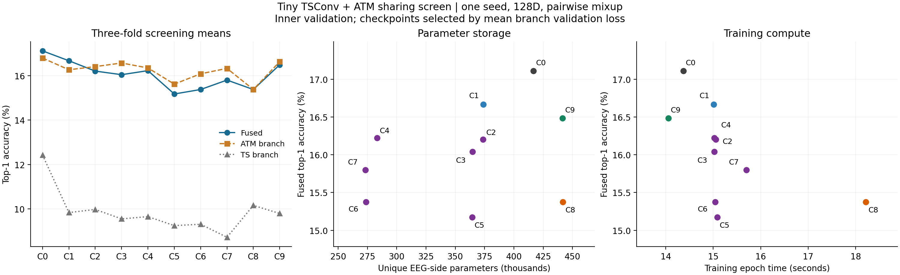

# Completed tiny TSConv + ATM sharing screen

All 30 runs completed: ten configurations, three inner folds, one prescribed seed
scheme, pairwise EEG mixup and 128-dimensional alignment. The saved scores reproduce
the reported top-1/top-5 accuracies, correctness overlaps and margins for every run.
This report covers the completed `screen_20260911_v2` experiment.

The main finding is that **where and how computation is shared matters more than
the number of shared parameters**. Sharing the dense readout removes about a
quarter of EEG-side parameters with a modest observed accuracy loss. Sharing a
stem that can actually be computed once saves meaningful training time and improves
accuracy against its matched independent control. The interpretation is limited by
a weak native ensemble gain in this screening protocol.

**What these accuracies measure.** Each slot trains on eight subjects. Slot 1
excludes subject 1 and validates on subject 2; slot 2 excludes subject 2 and
validates on subject 3; slot 3 excludes subject 3 and validates on subject 4.
Each uses the same 165 held concepts, with 10 images per concept, giving 1,650
validation queries arranged into fixed 200-candidate galleries. The excluded
outer subject is not evaluated. Training runs for all 40 epochs, 116 full batches
per epoch, batch size 1,024. TS and ATM branches target InternViT layers 33 and 28,
respectively, using separate image projectors and alignment heads.

The primary checkpoint minimizes the **mean of the two branch validation losses**.
The table reports top-1 at that checkpoint, averaged over the three inner folds.
It is **not mean best top-1 selected by accuracy**, and it is not the earlier
10-subject outer-test 40–41% result. Validation images, training-subject count,
checkpoint selection and model sizes differ from that earlier experiment.
Validation is reused for model selection and analysis; the numbers are development
estimates. There is no transductive test adaptation here.

**All ten configurations.** Times include training and gradient diagnostics but
exclude validation, dataset loading and artifact writing. EEG counts include EEG
alignment heads; the two image projectors add 819,456 parameters to every row.

| ID | Intervention | TS top-1 | ATM top-1 | Fused top-1 | Gain over best branch | EEG parameters | Train seconds/epoch |
|---|---|---:|---:|---:|---:|---:|---:|
| C0 | Native independent pair | 12.42% | 16.79% | **17.11%** | +0.32 pp | 416,756 | 14.37 |
| C1 | Compatible independent pair | 9.84% | 16.26% | 16.67% | +0.40 pp | 373,888 | 15.01 |
| C2 | C1 + shared temporal filters | 9.98% | 16.40% | 16.20% | −0.20 pp | 373,576 | 15.06 |
| C3 | C1 + shared spatial/projection block | 9.56% | 16.57% | 16.04% | −0.53 pp | 364,648 | 15.02 |
| C4 | C1 + shared dense readout | 9.66% | 16.34% | **16.22%** | −0.12 pp | **283,264** | 15.02 |
| C5 | C1 + shared temporal and spatial blocks | 9.25% | 15.62% | 15.17% | −0.44 pp | 364,336 | 15.08 |
| C6 | C5 + shared dense readout | 9.31% | 16.08% | 15.37% | −0.71 pp | 273,712 | 15.04 |
| C7 | C6 + shared normalization | 8.73% | 16.32% | 15.80% | −0.53 pp | 273,152 | 15.70 |
| C8 | Attention after independent temporal stems | 10.16% | 15.37% | 15.37% | 0.00 pp | 441,825 | 18.22 |
| C9 | C8 + shared stem computed once | 9.80% | 16.63% | **16.48%** | −0.14 pp | 441,489 | **14.05** |

C1 bundles interface changes, including TS position pooling from 36 to 8 and
changes to ATM electrode indexing and readout dimensions. Its comparison to C0
measures that combined architectural change. C2–C7 are the matched weight-sharing
interventions. C8 changes attention ordering and implementation; C9 must be judged
primarily against C8.

**Per-fold fused accuracies and selected epochs.** Epochs below are one-based;
raw logs and the original analyzer use zero-based epochs.

| ID | Slot 1 | Slot 2 | Slot 3 | Selected epochs, slots 1/2/3 | Mean using first 20 epochs |
|---|---:|---:|---:|---|---:|
| C0 | 20.06% | 14.48% | 16.79% | 34 / 39 / 38 | 15.80% |
| C1 | 20.30% | 13.39% | 16.30% | 34 / 25 / 18 | 15.82% |
| C2 | 18.79% | 13.82% | 16.00% | 34 / 38 / 17 | 15.39% |
| C3 | 19.45% | 13.33% | 15.33% | 34 / 36 / 18 | 14.55% |
| C4 | 19.70% | 13.76% | 15.21% | 34 / 38 / 18 | 15.54% |
| C5 | 17.94% | 12.42% | 15.15% | 34 / 36 / 29 | 14.46% |
| C6 | 18.55% | 12.36% | 15.21% | 34 / 36 / 31 | 14.55% |
| C7 | 18.18% | 13.15% | 16.06% | 34 / 36 / 32 | 14.67% |
| C8 | 18.06% | 11.82% | 16.24% | 21 / 14 / 18 | 15.31% |
| C9 | 18.24% | 14.24% | 16.97% | 21 / 32 / 17 | 15.66% |

The native reference gains 1.31 points when selection is allowed through epoch 40
rather than 20. Several configurations also change position in the ranking.
Twenty epochs would have been useful for a rough screen but insufficient to
freeze the final ranking. There are only three subject folds, with overlapping
training subjects and the same held concepts. The fold differences below are
descriptive; this study does not establish statistical equivalence or superiority.

**The most informative matched comparisons.**

| Change | Mean fused delta | Slot 1 / 2 / 3 deltas | Interpretation |
|---|---:|---|---|
| C0 → C1: compatible interface | −0.44 pp | +0.24 / −1.09 / −0.48 | Modest fused cost, larger TS weakening |
| C1 → C2: temporal sharing | −0.46 pp | −1.52 / +0.42 / −0.30 | Saves just 312 parameters; little practical upside |
| C1 → C3: spatial sharing | −0.63 pp | −0.85 / −0.06 / −0.97 | Negative in all three folds |
| C1 → C4: dense sharing | −0.44 pp | −0.61 / +0.36 / −1.09 | Useful storage/accuracy trade-off |
| C1 → C5: temporal + spatial sharing | −1.49 pp | −2.36 / −0.97 / −1.15 | Broad early sharing hurts consistently here |
| C5 → C6: add dense sharing | +0.20 pp | +0.61 / −0.06 / +0.06 | Adding shared parameters need not add an accuracy penalty |
| C6 → C7: add shared normalization | +0.42 pp | −0.36 / +0.79 / +0.85 | No evidence that private normalization is essential |
| C1 → C8: move attention after stem | −1.29 pp | −2.24 / −1.58 / −0.06 | Substantial topology cost before sharing |
| C8 → C9: compute shared stem once | **+1.11 pp** | **+0.18 / +2.42 / +0.73** | Positive in every fold, with measured compute savings |

The temporal/spatial interaction, C5−C2−C3+C1, averages −0.40 points but is
approximately zero, −1.33 and +0.12 across folds. The dense interaction,
C6−C5−C4+C1, averages +0.65 points. These mixed fold patterns do not support a
simple monotonic law relating the fraction of shared parameters to accuracy.
Temporal sharing in C2–C7 also couples filters operating on physical time in
one branch and learned latent coordinates in the other. Its cost does not prove
that a common physical-time stem cannot work; C9 directly suggests it can.

**Parameter savings and compute savings are different results.** C4 saves
90,624 EEG parameters relative to C1: **24.24% of EEG-side storage, 7.59% of total
model parameters**, with essentially unchanged training time. C6/C7 save about
27% of EEG parameters, also without a speedup. Their shared weights are still
applied twice to different inputs.

C9 removes only 336 parameters relative to C8, but reduces training epoch time
from 18.22 to 14.05 seconds (**22.85%**), the measured non-diagnostic warm step
from 116.5 to 80.3 ms (**31.08%**), and peak allocated GPU memory from 4,750 to
3,869 MiB (**18.54%**). This is the strongest compute result. Against the original
C0 pair, however, C9 is only 2.20% faster per training epoch, has 5.93% more
registered EEG parameters, and loses 0.63 points of fused accuracy. It has not
yet achieved the desired one-model cost relative to the native pair.

Registered counts also need care: C0 contains 58,292 EEG-side parameters unused
under the study's fixed subject-token policy; C1 contains 1,792. Thus C1's lower
registered count partly removes dead parameters. The corresponding reachable
counts are 358,464 and 372,096, respectively. This is not evidence that the
compatible interface compresses useful native capacity. Across all 30 runs,
recorded training time totals **5.09 GPU-hours**, excluding validation/loading,
verification runs, writes, and interrupted work.

**The baseline has complementary errors, but equal fusion realizes little gain.**
For C0, either branch is correct on 23.54% of queries, versus ATM's 16.79% and
fusion's 17.11%. The 23.54% is a correctness-union diagnostic, not an attainable
retrieval accuracy or a strict upper bound for score fusion: fusion can also
rescue queries on which both branches were wrong.

Relative to ATM, C0 fusion wins on an average of 100.3 queries per fold and loses
on 95.0, leaving just 5.3 net extra correct queries out of 1,650. For C6 the same
comparison is 98.3 wins versus 110.0 losses. This is a useful distinction between
having complementary information and combining it reliably.

The compatible interface weakens TS from 12.42% to 9.84%, while ATM moves from
16.79% to 16.26%. TS remains weaker in every configuration. Meanwhile CKA falls
from 0.690 in C0 to 0.636 in C1, and the distractor-complementarity bonus grows
from 0.143 to 0.169. C6 has a still larger bonus, 0.182, despite worse accuracy.
Increasing representation diversity or this bonus alone would therefore be a
poor optimization objective. Preserving branch strength matters too.

For row-standardized score vectors a and b and correct candidate y, the recorded
margin bonus is

`margin((a+b)/2) - (margin(a)+margin(b))/2`

`= (max_wrong(a)+max_wrong(b))/2 - max_wrong((a+b)/2) >= 0`.

Its nonnegativity follows from the maximum operation. A positive value diagnoses
distractor disagreement; by itself it neither establishes useful semantic
complementarity nor guarantees a positive top-1 gain. The audit verified this
identity and the recorded margins using all saved score rows.

**Checkpoint coupling accounts for part of the native pair's cost.** C0's TS
branch selects validation-loss minima at epochs 16/16/6 across folds, while ATM
selects 40/39/38. A common checkpoint selects 34/39/38. Combining independently
selected branch snapshots changes fused accuracy from 17.11% to **17.78%**:
+1.45, +1.03 and −0.48 points by fold. The average benefit is 0.67 points, with
no extra training. For C1, the mean change is just +0.12 points (16.67 → 16.79).
This supports different preferred training durations as one mechanism; it is
not a universal checkpoint penalty. Branch-specific loss minima are also not
necessarily accuracy maxima.

**Additional analysis using the saved scores: unequal fusion weights.** To probe
the branch imbalance, I evaluated `alpha*rowz(TS)+(1-alpha)*rowz(ATM)` on a grid
from 0 to 1 in steps of 0.05. For each held screening fold, alpha was selected
using the other two folds; ties favored the value nearest 0.5. No new models
were trained. This exploratory diagnostic does not replace the fixed-fusion
primary results and is not a clean outer evaluation: checkpoints were already
selected on their own validation data, and held concepts recur across folds.

| ID | Original equal fusion | Weight selected on other folds | TS weights for held slots 1/2/3 |
|---|---:|---:|---|
| C0 | 17.11% | **18.26%** | 0.30 / 0.25 / 0.30 |
| C1 | 16.67% | 17.11% | 0.35 / 0.25 / 0.25 |
| C2 | 16.20% | 17.29% | 0.15 / 0.20 / 0.15 |
| C3 | 16.04% | 17.21% | 0.25 / 0.25 / 0.15 |
| C4 | 16.22% | **17.49%** | 0.35 / 0.30 / 0.20 |
| C5 | 15.17% | 16.87% | 0.20 / 0.25 / 0.20 |
| C6 | 15.37% | 17.03% | 0.20 / 0.25 / 0.20 |
| C7 | 15.80% | 16.67% | 0.20 / 0.20 / 0.10 |
| C8 | 15.37% | 16.12% | 0.35 / 0.30 / 0.30 |
| C9 | 16.48% | 16.59% | 0.35 / 0.15 / 0.20 |

Every selected weight favors ATM. C0 improves by 1.15 points over equal fusion;
C4 improves by 1.27 and exceeds C1 under this alternative rule. Some apparent
sharing penalties therefore depend on the fusion rule. The results motivate
testing calibrated fusion with a properly reserved calibration split, rather
than treating every equal-fusion loss as destroyed information. These gains
must not be added to the independent-checkpoint gains: the interventions were
analyzed separately.

**Gradient diagnostics do not show broad strong opposition.** The values below
average the recorded diagnostic cosines over 40 epochs and three folds. Each
epoch averages five sampled batches. Different private blocks can be compared
in their matching coordinates, but their evolving private parameter points
are not a true shared-parameter conflict measurement.

| Configuration and genuinely shared block | Mean gradient cosine |
|---|---:|
| C2 temporal | +0.058 |
| C3 spatial | +0.099 |
| C4 dense readout | −0.002 |
| C5 temporal / spatial | +0.139 / +0.110 |
| C6 temporal / spatial / readout | +0.144 / +0.110 / −0.005 |
| C7 temporal / spatial / readout | +0.195 / +0.104 / +0.002 |
| C9 temporal stem | **+0.305** |

C9's temporal gradients are more aligned than the corresponding separate-block
diagnostic in C8 (+0.033). This is consistent with compatible learning signals
after both branches start from the same raw-EEG stem. It does not establish
alignment as the cause of the accuracy gain; alignment itself changes during
training. Dense gradients are nearly orthogonal, not strongly opposed. Negative
epoch-mean frequencies are available in the CSV; they are **not fractions of
individual conflicting updates**. The saved averages cannot rule out transient
conflict. C0 temporal dimensions differ, so no meaningful direct cosine was
reported for that pair.

**What to carry forward.** C4 is the strongest storage-saving candidate; C9 is
the strongest evidence for sharing actual computation. A useful next candidate
would combine a C9-style computed-once stem with a shared dense readout, preserving
the two branch-specific processing routes and image/alignment heads. Their
benefits cannot be assumed additive and the combination has not been trained.
The C5 result argues against forcing one set of temporal/spatial weights across
different input coordinate systems merely to maximize sharing. C7 provides no
support for private normalization being the essential protective mechanism.

Before extending this to four members or claiming an explanation of the original
40–41% ensemble, the highest-value control is a tiny independent pair with a
clear ensemble advantage under the intended evaluation protocol. The present
screen establishes useful architectural trade-offs, but the weak TS branch,
unequal preferred checkpoint times and small equal-fusion gain limit its ability
to explain the full-size phenomenon. A focused confirmation of C0/C1/C4/C8/C9
with reserved calibration and outer evaluation would be more informative than
another broad grid. No additional training was launched during this analysis.

**Artifacts and reproducibility.** [Per-fold measurements](per_fold.csv),
[configuration means](configuration_means.csv), [complete audit and analysis](analysis.json),
[figure PDF](overview.pdf), and [analysis script](../../../ensemble_experiments/analyze_tiny_sharing_complete.py).
The audit covers score-derived metrics and selection consistency; it does not
rerun inference from all 30 saved weight checkpoints. Training preflight had
already passed 62 structural checks, all ten real-data train/eval tests, and
bitwise resume checks for C0/C7/C9. The original near-zero-gain gate warning
remains recorded; with all folds complete, C1's mean gain over its best branch
is slightly larger than C0's (+0.40 versus +0.32 points).
