Your presentation has the right backbone. I would organize it around a single claim:

> Ensemble gains come from strong members with structured, exploitable error diversity.
> Naturally occurring score decorrelation is a powerful marker of complementarity, but
> generic output decorrelation is neither necessary nor sufficient.

Before the results, include a small protocol box: all numbers are 200-way plain-cosine retrieval, score matrices are standardized independently per query/member and uniformly averaged, and “test-selected” means checkpoint selection by minimum held-out test loss.

## 1. Seed diversity is weak

Use the three matched TSConv runs as the correlated-clone control.

| TSConv seed | Solo top-1 |
|---|---:|
| 3300 | 35.05 |
| 3301 | 34.85 |
| 3302 | 34.60 |
| Three-seed row-z ensemble | **37.10** |
| Individual-member oracle | 46.80 |

Thus three seeds give only **+2.05 points** over the best seed under row-z. Mean pairwise score correlation is **0.956**, and the fold-level confidence interval for the historical +2.15 gain includes zero: `[-0.03, +4.33]`.

The matched ATM control now gives the same conclusion:

| ATM seed | Top-1 |
|---|---:|
| 3300 | 35.20 |
| 3301 | 34.40 |
| 3302 | 35.15 |
| Three-seed row-z ensemble | **37.45** |
| Individual-member oracle | 47.45 |

The full committee gains only **+2.25 points** over the best seed. Mean pairwise score
correlation is **0.960**, and its fold-level gain over seed 3300 has a 95% confidence
interval of `[-0.22, +4.72]`. Its per-subject top-1 scores are:

```text
42.0 46.5 26.0 29.0 46.0 23.0 33.0 35.0 45.0 49.0
mean = 37.45
```

The matched three-seed controls are therefore strikingly symmetric: TSConv gains
**+2.05 points** and ATM gains **+2.25 points**, while both retain score correlation
around `0.96`. Random initialization provides useful but limited diversity; it does not
reproduce the much larger cross-encoder gains.

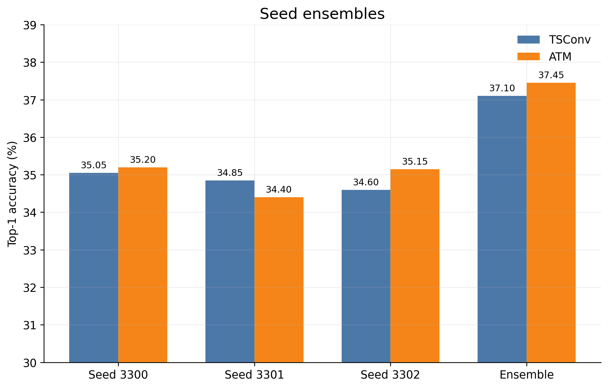

There is also a bookkeeping issue worth resolving before publication: the audited TSConv seed committee uses dumps named `p3300/1/2`, while another seed-3300 export is called `pair` and is not numerically identical. The `p3300/1/2` committee is already documented, but its exact source paths should be frozen in a provenance table—or seed 3300 should be re-exported.

## 2. Image-layer diversity helps, but saturates

For each encoder, select the best three InternViT depths from layers 23/25/28/31/33/35:

| Encoder family | Best solo | Best depth-only k=3 | Gain |
|---|---:|---:|---:|
| ATM | 36.50 | **39.70** (`25+31+35`) | +3.20 |
| TSConv | 36.10 | **41.15** (`28+31+33`) | +5.05 |

The depth experts remain strongly correlated:

- ATM depth-pair score correlation: **0.915**
- TSConv depth-pair score correlation: **0.918**

Increasing committee size confirms saturation:

| k | Best all-ATM | Best all-TSConv |
|---:|---:|---:|
| 1 | 36.50 | 36.10 |
| 2 | 38.65 | 39.75 |
| 3 | 39.70 | 41.15 |
| 4 | 39.90 | 41.35 |
| 5 | 40.15 | 41.40 |
| 6 | 39.85 | 40.70 |

So depth diversity is useful, but cannot explain the 45–49% results.

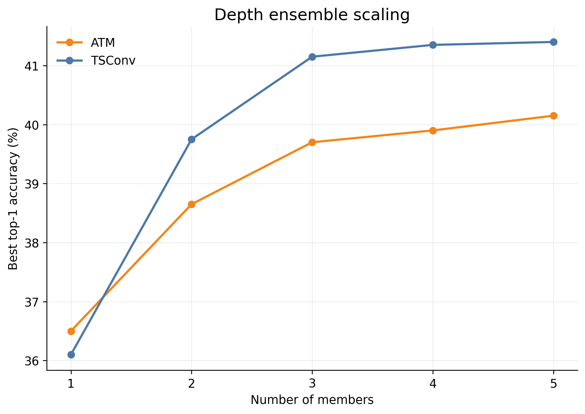

## 3. Cross-encoder diversity is the first major jump

The cleanest controlled comparison uses the same InternViT-28 target:

| Model | Top-1 |
|---|---:|
| ATM-28 | 35.20 |
| TSConv-28 | 36.10 |
| ATM-28 + TSConv-28, row-z | **40.65** |

That is **+4.55 points** over the better solo with only two models. Their score correlation falls to **0.851**, and their individual-member oracle is **49.95%**.

Within the original 12-depth roster:

| Pool | Best k=3 |
|---|---:|
| ATM depths only | 39.70 |
| TSConv depths only | 41.15 |
| Mixed ATM/TSConv depths | **45.00** |

The best mixed triple is `ATM-28 + TSConv-33 + TSConv-35`.

A useful mechanism summary is:

| Diversity changed | Score correlation | Mean pair gain |
|---|---:|---:|
| Seed only | 0.956 | +1.58 |
| ATM depth | 0.915 | +2.60 |
| TSConv depth | 0.918 | +3.20 |
| Encoder and visual target both changed | **0.814** | **+5.17** |

This correlation/gain table explains the progression rather than merely reporting it.

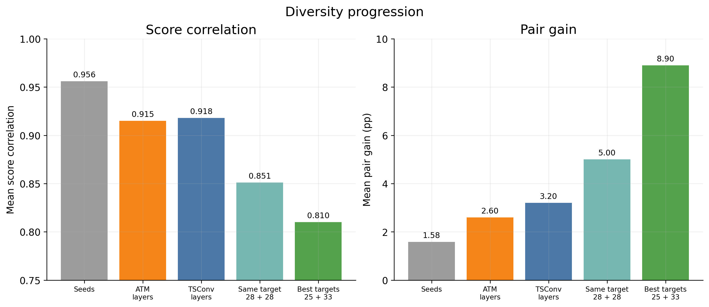

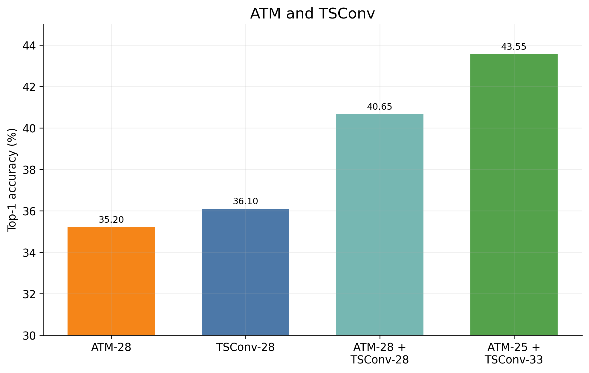

## 4. Pairwise complementarity predicts ensemble gain

Across the completed 45-model test-selected roster, there are 990 possible pairs. Under
the fixed row-z fusion rule, score correlation is strongly associated with gain over the
pair mean:

| Candidate metric | Spearman correlation with gain over pair mean |
|---|---:|
| Score correlation | **-0.920** |
| Margin correlation | -0.910 |
| Correctness correlation | -0.907 |
| Wrong-winner agreement | -0.904 |
| Prediction disagreement | +0.896 |
| Oracle headroom over the stronger member | +0.669 |

Gain over the pair mean is the cleaner outcome for studying the mechanism because it
removes much of the direct contribution of member strength. Gain over the stronger member
remains the more relevant deployment measure; for that outcome, oracle headroom is the
best candidate metric in the current table (`rho = 0.898`). The pair plot colors points by
mean solo strength so that strength and diversity can be read together.

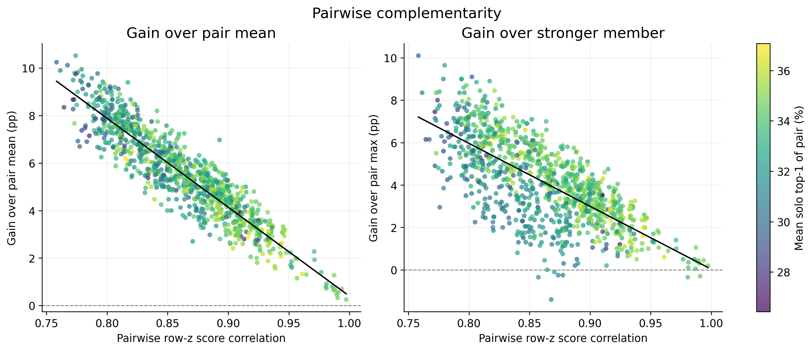

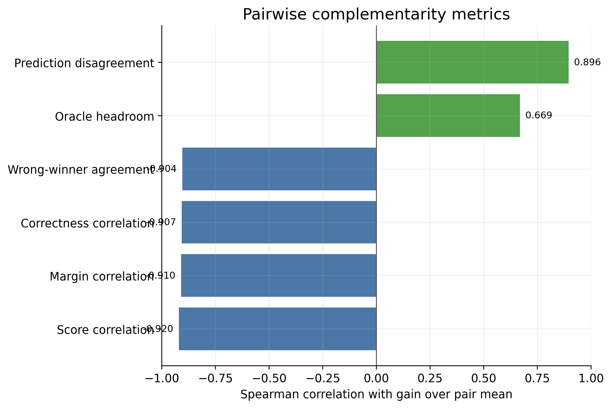

These 990 pairs are not 990 statistically independent observations: the same 45 models
and ten subjects recur across many pairs. The associations are therefore strong
descriptive and model-selection evidence, but should not be presented as an ordinary
990-sample confirmatory correlation test.

## 5. From correlation to useful complementarity

### Direct decorrelation gives mixed results

The direct intervention asks a causal question that the observational pair analysis
cannot answer: if score correlation is reduced while the individual objectives remain
active, does ensemble accuracy necessarily increase?

The twin-TSConv sweep says no:

| Lambda | Beta | Score correlation | Pair top-1 |
|---:|---:|---:|---:|
| 0.01 | 0.0 | 0.956 | 37.55 |
| 0.05 | 0.0 | 0.957 | **38.25** |
| 0.10 | 0.0 | 0.955 | 36.90 |
| 0.50 | 0.0 | **0.569** | 36.70 |
| 0.50 | 0.5 | 0.618 | 35.35 |

The best pair occurs at `lambda=0.05`, where correlation barely changes. Conversely,
`lambda=0.50` produces a very large correlation reduction without an accuracy gain. The
ensemble-loss term (`beta=0.5`) does not rescue the high-lambda regime.

The controlled batch-512 ATM+TSConv sweep reaches the same qualitative conclusion:

| Setting | Pair top-1 | Gain over stronger member | Score correlation | Oracle top-1 | Oracle headroom realized |
|---|---:|---:|---:|---:|---:|
| `lambda=0` | 40.15 | +2.90 | 0.850 | 48.75 | 0.148 |
| `lambda=0.10` | 40.40 | +3.90 | 0.828 | 48.70 | 0.212 |
| `lambda=0.25` | 40.90 | +3.40 | **0.565** | 49.35 | 0.269 |

The stronger intervention lowers correlation by `0.285`, yet improves pair accuracy by
only `0.75` point. It creates some useful diversity, but far less than the observational
correlation/gain relationship might suggest. Correlation can be reduced through changes
that do not place additional probability mass on the correct candidate; this is junk
diversity rather than complementarity.

### Complementary-strength rescue is more promising

The rescue loss targets division of labor rather than disagreement itself. Detached soft
responsibilities give more weight to the member that currently explains each query
better, while the ordinary individual losses remain active.

| Rescue gamma | Pair top-1 | Gain over stronger member | Score correlation | Oracle top-1 | Oracle headroom realized |
|---:|---:|---:|---:|---:|---:|
| 0.00 | 40.15 | +2.90 | 0.850 | 48.75 | 0.148 |
| 0.10 | 40.75 | +4.10 | 0.851 | 48.15 | 0.288 |
| **0.30** | **41.90** | **+5.20** | 0.846 | 47.80 | **0.393** |
| 0.50 | 41.65 | +4.35 | 0.848 | 48.35 | 0.379 |

The best rescue setting improves pair accuracy by `+1.75` points without materially
changing score correlation. It also has slightly *less* oracle coverage than the control,
but realizes much more of the available headroom. This points to three distinct parts of
the ensemble mechanism:

1. **Member strength:** both members must retain useful solo signal.
2. **Available complementarity:** at least one member must be correct, measured by oracle
   coverage, double faults, and correctness overlap.
3. **Usable complementarity:** the correct member must be confident in a compatible way
   so that the fixed fusion rule can recover the answer.

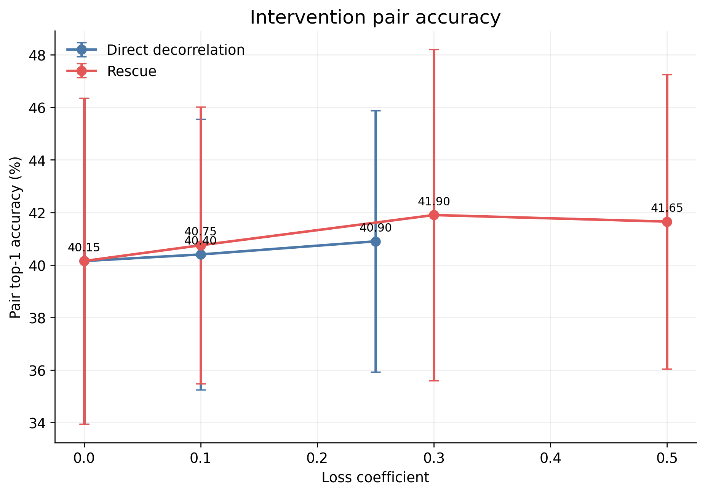

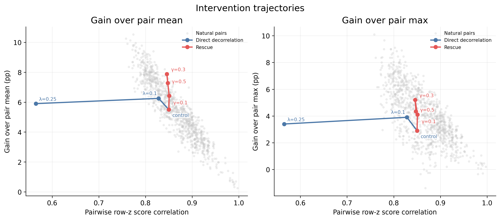

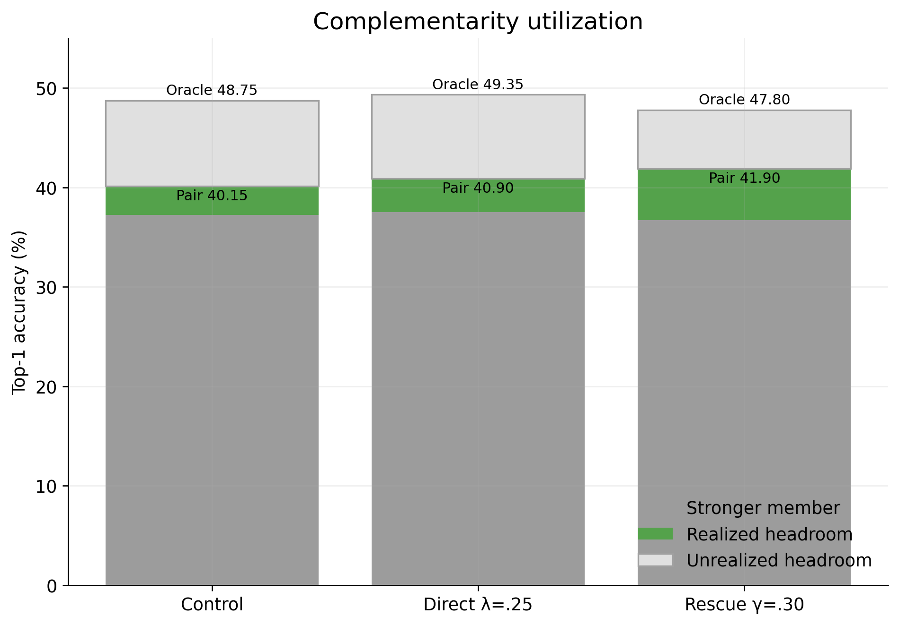

The intervention trajectory should be the main causal figure. It overlays the completed
ATM+TSConv direct-decorrelation and rescue arms on the natural-pair cloud. Moving left by
force does not reliably move upward, while rescue can move upward without moving left.
The error bars in the accuracy figure are subject-level normal-approximation 95% intervals;
they communicate the ten-fold variability and are not adjusted for hyperparameter search.

The current mechanistic conclusion is therefore:

> Natural decorrelation predicts ensemble gain because it often accompanies structured
> complementary evidence. Decorrelation alone is not the cause. Training objectives
> should target correct-query rescue, oracle-headroom utilization, or compatible confidence
> allocation—not disagreement for its own sake.

The rescue dose response is still a test-selected discovery result. Its completed ValCon
confirmation should be reported separately once every dose has all ten subjects; partial
ValCon averages are deliberately excluded here.

## 6. Test-selected engineering ceiling

Under fixed row-z fusion, exhaustive all-ten selection over the current 30-member completed roster gives:

| k | Best top-1 |
|---:|---:|
| 1 | 37.05 |
| 2 | 44.10 |
| 3 | 46.55 |
| 4 | **48.20** |
| 5 | 48.85 |
| 6 | **49.50** |

The practical headline should be the compact **48.20% k=4** committee:

- Squeezeformer/InternViT-28
- ATM/ViT-H
- ATM/InternViT-28 group
- TSConv/InternViT-33 group

Every member matters: removing one lowers accuracy to 44.75–45.65, a drop of **2.55–3.45 points**.

I would call **49.50% the optimistic post-hoc ceiling**, not the principal result. It is the best of 593,775 k=6 combinations. The compact 48.20% result is easier to explain and considerably less “searchy.”

Also show the front-loaded character:

- k=1 → k=2: **+7.05**
- k=2 → k=3: +2.45
- k=3 → k=4: +1.65
- k=4 → k=5: +0.65
- k=5 → k=6: +0.65

The first complementary member therefore contributes more than the four subsequent additions combined (**+7.05** versus **+5.40**).

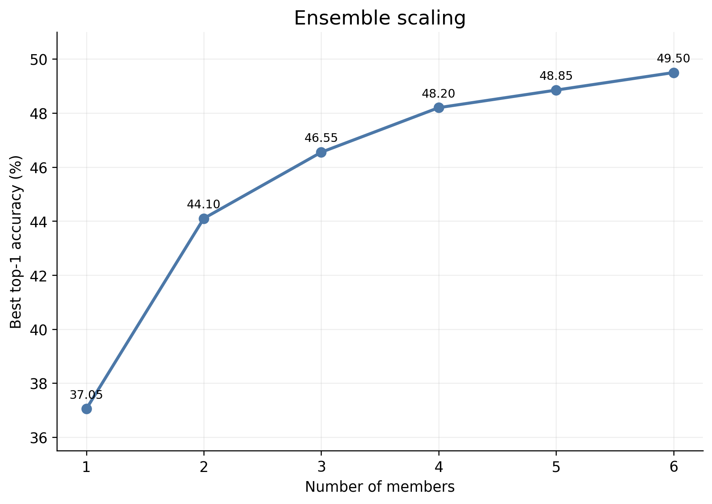

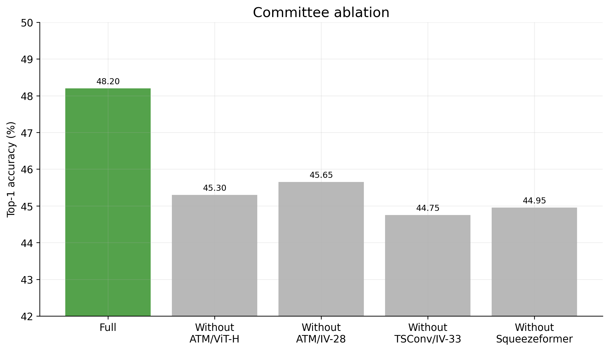

## 7. ValCon is preferable to LOSO subject validation

This should begin with the matched three-architecture comparison:

| Architecture | LOSO-subject validation | ValCon | Difference |
|---|---:|---:|---:|
| ATM / InternViT-28 | 29.15 | **33.40** | +4.25 |
| TSConv-group / InternViT-33 | 30.75 | **33.30** | +2.55 |
| TSConv / BigG | 30.10 | 30.10 | 0.00 |
| Mean solo | 30.00 | **32.27** | +2.27 |

For fixed ensembles of those same models:

| Committee | LOSO val | ValCon |
|---|---:|---:|
| ATM-IV28 + TSConv-IV33 | 37.70 | **41.40** |
| All three | 40.20 | **43.15** |

This supports the explanation: ValCon retains all nine source subjects and validates across held-out concepts, whereas LOSO validation removes an entire source subject, trains on only eight, and selects using a validation domain that may poorly predict the target subject.

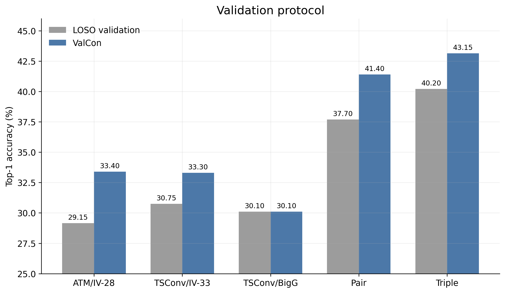

The extended ValCon roster reaches:

| k | ValCon | Matched test-selected controls |
|---:|---:|---:|
| 1 | 33.40 | 36.35 |
| 2 | 41.40 | 44.60 |
| 3 | 43.75 | 46.00 |
| 4 | 44.90 | 47.75 |
| 5 | 45.15 | 48.40 |
| 6 | **45.65** | **48.90** |

Here too, gains are front-loaded: k=1 → k=2 contributes **+8.00** under ValCon and **+8.25** for the matched test-selected controls; k=2 → k=6 adds only **+4.25** and **+4.30**, respectively.

Across the ten matched ATM/TSConv depth arms, test checkpoint selection contributes **+2.235 points on average**. That is the cleanest quantification of test-selection optimism.

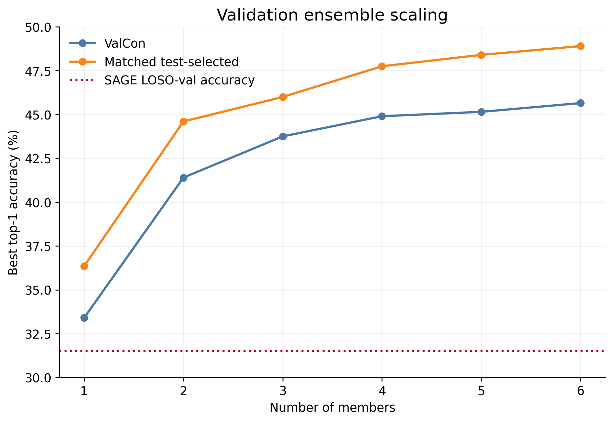

## What remains missing

- Provenance cleanup or re-export for the TSConv seed-3300 control.
- Decide whether the four completed encoder-family candidates belong in the main report;
  none displaces the current ensemble headline.
- A genuinely predeclared ensemble evaluation. ValCon fixes checkpoint selection, but the best ValCon member combinations above are still selected post hoc on all ten test folds.
- Clear separation between row-z results and historical raw-fusion numbers such as the 44.60 diverse triple and 45.35 reference quartet.
- A family- or model-blocked validation of the pairwise complementarity predictors. The
  current 990-pair correlations are descriptive because pairs share members.
- A predeclared rescue setting evaluated with completed ValCon selection. The current
  test-selected `gamma=0.30` result is a promising mechanism result, not yet a final honest
  improvement.

The existing detailed audit is in [ensemble_results_analysis_20260823.md](/nasbrain/p20fores/Neurobridge_SSL/ensemble_experiments/analysis/ensemble_results_analysis_20260823.md:1). The exact test-selected and ValCon sweeps are in [target_matrix_test_extended_z.json](/nasbrain/p20fores/Neurobridge_SSL/ensemble_experiments/analysis/target_matrix_test_extended_z.json:1) and [target_matrix_valcon_extended_z.json](/nasbrain/p20fores/Neurobridge_SSL/ensemble_experiments/analysis/target_matrix_valcon_extended_z.json:1).
